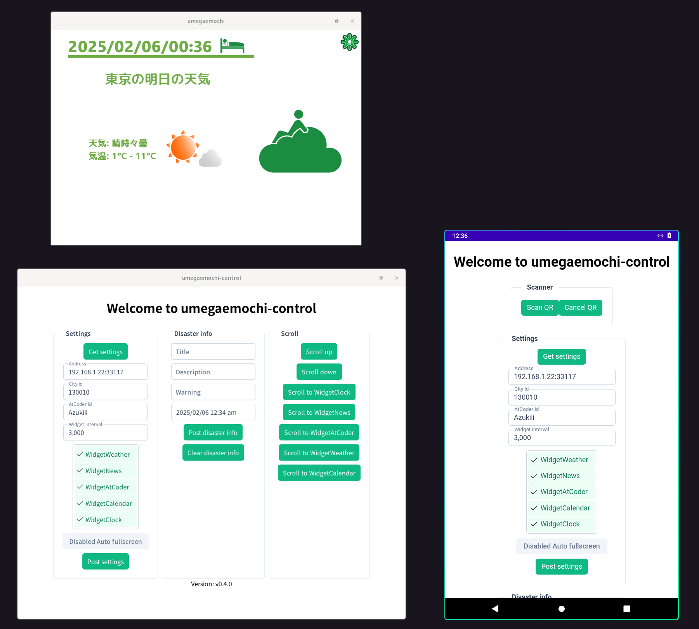
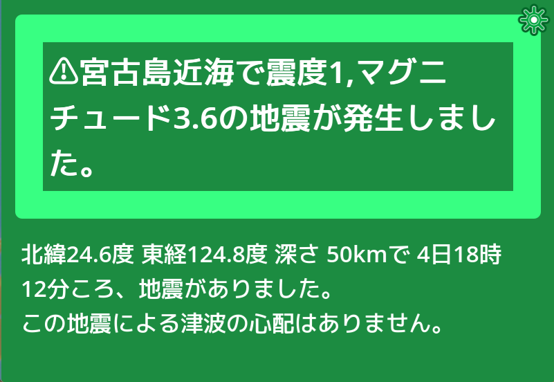

# umegaemochi

ピクトグラムのある日常を

親しみやすい電光掲示板

災害時

## umegaemochi-control
[umegaemochi-control](https://github.com/yadokani389/umegaemochi-control)を用いてスマホやPCから手軽に設定を変えたり操作をすることができます.

## Supported Platforms

- Linux
- macOS
- Windows
- Android

### Warning

v0.5.1以前のリリースにあるmacOS用バイナリはcodesignされておらず開くことができません.
自分でするかコードからビルドしてください.

v0.5.2以降ではprivacy & settings -> open anywayから開くことができます.
